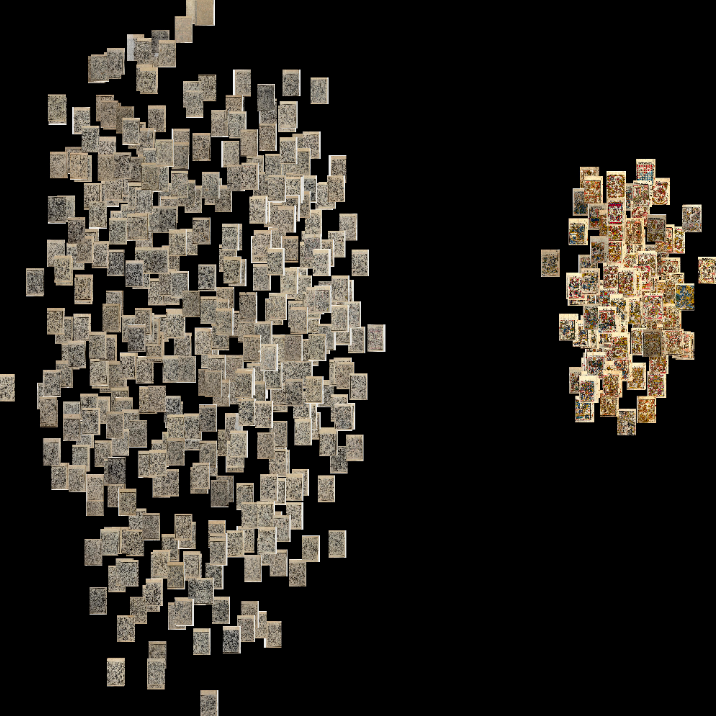
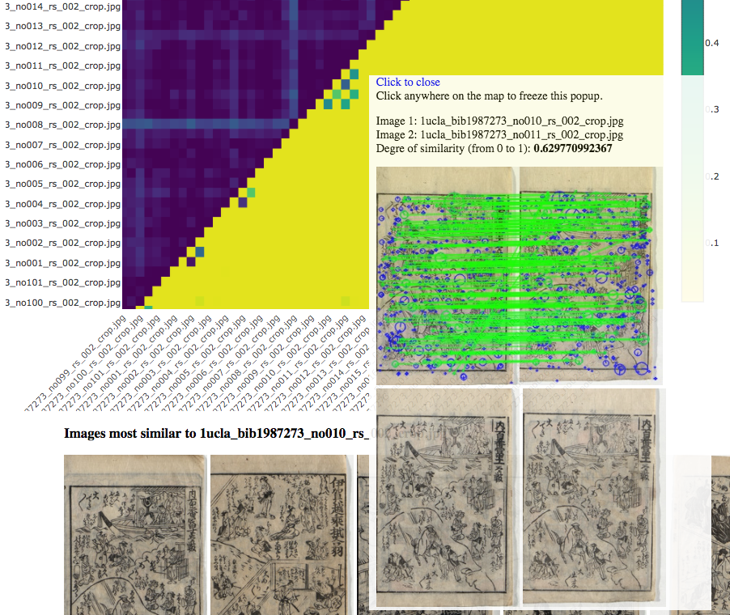
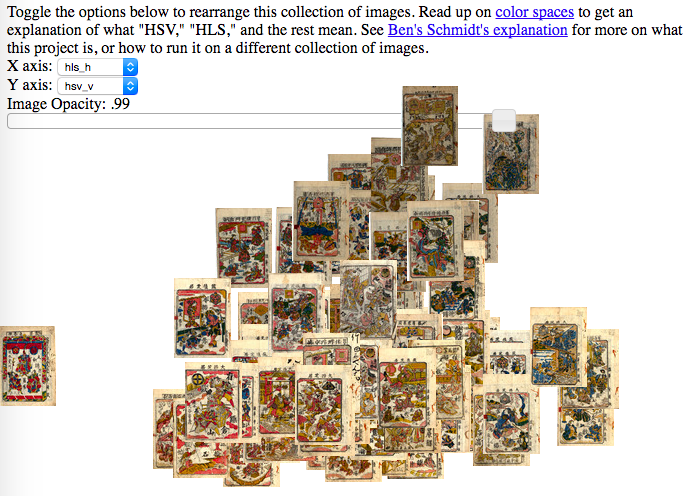
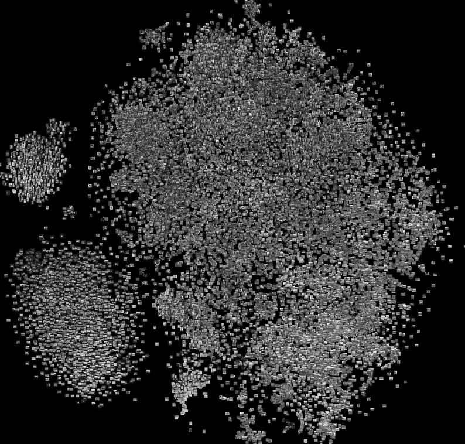
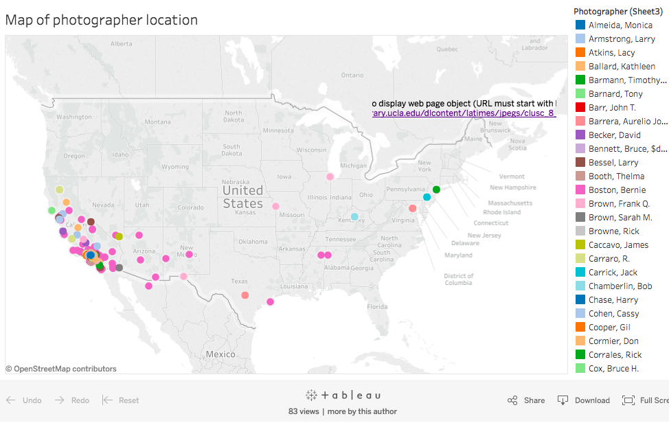
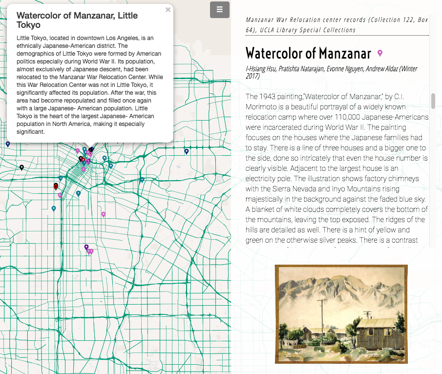
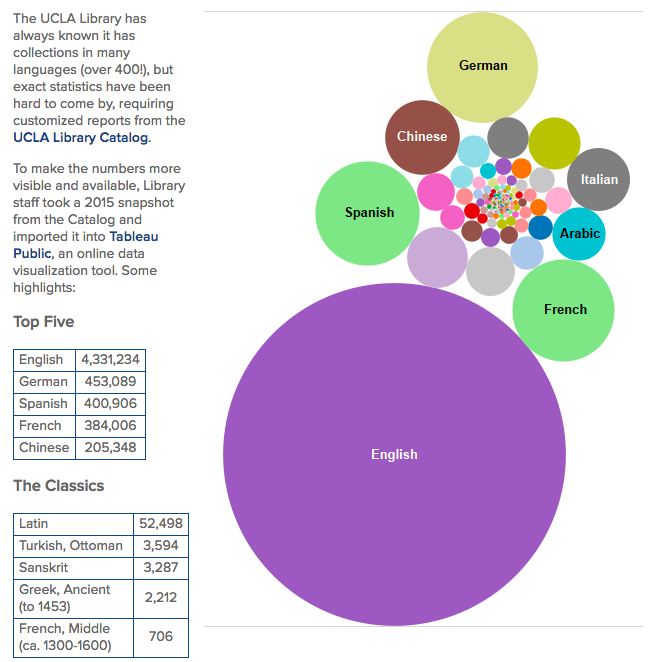

## Experiments at UCLA

<table>
<tr>
<th>
  
</th>
  <th>A zoomable visualization of thumbnails in the Kabuki playbills collection, clustered by image similarity as determined by a neural network</th>
<th>
  
</th>
  <th>An interactive similarity map of the inner pages of the kabuki playbills, using neural network and traditional computer vision to determine similarity. Darker cells=more similar</th>
<th>
  
</th>
  <th>An interactive colorspace viz of the kabuki playbills collection</th>
</tr>
<tr>
<th>
  
</th>
<th>A zoomable visualization of thumbnails in the LA Times Photo Archive, clustered by neural network image similarity</th>
<th>
  
</th>
  <th>A map and photo viewer interface to the LA Times Photo Archive</th>
<th>
  
</th>
  <th>The Lyrical Map of Los Angeles</th>
</tr>
<tr>
<th>
  
</th>
  <th>Collections in the UCLA library, visualized by language</th>
<th>
  
</th>
  <th>Crowdsourcing transcriptions of the William Sachtleben Diaries collection</th>
<th>&nbsp;</th>
</tr>
</table>

## Experiments and projects at other institutions

### NYPL (New York Public Library) Labs
- [**Public Domain Collections**](https://www.nypl.org/research/collections/digital-collections/public-domain): More than 180,000 items in the NYPL's Digital Collections are in the Public Domain and have been made available for download, remixes, and these impressive [visualizations](http://publicdomain.nypl.org/pd-visualization/).
- The NYPL Labs did many other ambitious [projects](https://www.nypl.org/blog/2014/09/03/generative-ebook-covers), several of which used data from their extensive digital collections.

### Yale University Library Digital Humanities Lab
- [Photogrammar](http://photogrammar.yale.edu/): A web-based platform for organizing, searching and visualizing the 170,000 photographs created by the United States Farm Security Administration and Office of War Information (FSA-OWI) from 1935–1945.
- [Neural Neighbors](https://yaledhlab.github.io/neural-neighbors/): A project underway to "enable users to identify visual similarity at scale across collections of photographs and videos," focused on the Beinecke Library's vast Meserve-Kunhardt Collection of nineteenth-century photographs.
